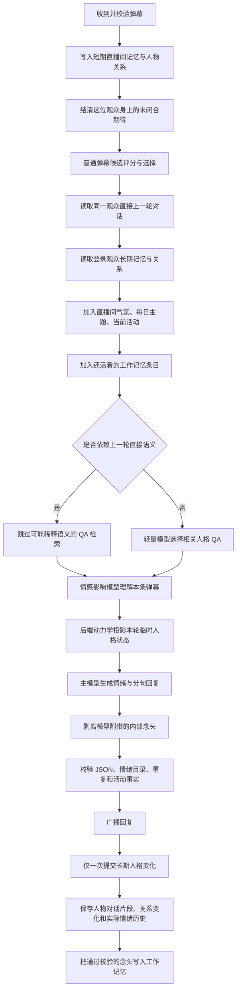

# AI 主播状态与思维流程

本文只描述数字主播“超天酱”如何维护自身状态、理解直播间并形成回复，不描述 HTTP、WebSocket、数据库表或部署结构。

## 1. 主播持续维护的状态

### 1.1 公开人格状态

这三个值范围均为 `0~1`，会持久化并直接影响回复语气：

| 状态 | 含义 | 典型表现 |
|---|---|---|
| `mood` | 心情、积极程度 | 高时更开心温柔，低时更消沉或冷淡 |
| `stress` | 压力、负荷 | 高时更疲惫、焦虑、易失去耐心 |
| `darkness` | 阴暗、毒舌倾向 | 高时更容易冷笑、嘲讽、毒舌或阴暗表达 |

状态变化不是直接照抄模型数值。模型只负责理解语义并提出影响量，后端动力学再加入单次变化上限、边界衰减、自然回归、话题重复降权和直播间气氛修正，防止一次弹幕让人格瞬间翻转。

### 1.2 后端内部人格状态

这四个值同样为 `0~1`，不直接推送给前端，但会转化为回复风格指导：

| 状态 | 含义 | 主要来源 |
|---|---|---|
| `arousal` | 兴奋、激活程度 | 内容强度、压力变化、弹幕速度、直播开始 |
| `fatigue` | 疲劳程度 | 压力、直播负荷、持续活跃、下播恢复 |
| `attachment` | 对观众整体的依恋 | 正负互动、熟悉度、信任、连续对话、个人记忆证据 |
| `confidence` | 当前自信 | 被认可或否定、压力、阴暗度、熟客关系和话题承接 |

内部状态也有变化上限和回归基线。陌生观众的一句话不会产生与长期熟客相同的依恋影响。

### 1.3 行为倾向

- `reply_aggressiveness`：主动回复倾向，参与“现在是否选择一条普通弹幕”。
- `ignore_probability`：忽略倾向，为人格行为保留不必句句回应的空间。

实际选择还会受弹幕负载、SC 是否待处理、回复队列容量和本地候选评分约束。

### 1.4 观众人物状态

登录观众以不可变 `account_id` 维护人物关系；游客只在当前连接/直播上下文内存在。人物状态包括：

- 熟悉度、好感、信任；
- 越界次数、互动次数、被回复次数；
- 最近话题及对话连续性；
- 登录观众的长期对话片段、话题摘要、重要性和时间衰减；
- 当前昵称、昵称版本和一次性的近期改名感知。

昵称只是展示属性，不是人物主键；同名用户不会共享关系或记忆。

### 1.5 直播长时状态

- 开播状态、排期时区和当前直播场次；
- 当日主题：低权重点缀，不要求每句话围绕主题；
- 当前活动：例如“正在直播超级马里奥”，在同一版本内保持具体对象连续；
- 活动版本、开始时间、最近活动历史和公开演出额度；
- 直播间真实弹幕速率、整体情感、活跃人数和静默时长。

当前活动比每日主题更具体，但二者都不能覆盖观众正在直接问的问题。

### 1.6 表达状态

- 39 种可输出情绪/动作；
- 最近实际使用的情绪序列、重复频率和过度使用项；
- 推荐替代动作和极端情绪保留规则。

最终输出前会修正非法情绪和机械重复，并保持每句话与一个情绪动作对应。

### 1.7 工作记忆：未闭合的意图（Prompt RAM）

主播还会在**场次内**记住少量「自己还没闭合的意图」，例如「刚回答了小明的问题，
正等他回话」。这是秒/分钟级的工作记忆，与 1.4 的长时人物记忆分工明确：

| | 时间尺度 | 内容 | 召回方式 |
| --- | --- | --- | --- |
| 情景记忆 | 天/月，跨场次 | 已发生的事实 | 话题命中才注入 |
| 工作记忆 | 秒/分钟，场次内 | 未闭合的意图与念头 | 只要还活着就注入 |

四类条目：等某位观众回话、答应过要做的事、还想聊的念头（无对象）、
决定暂时不提的事。每位观众最多一条「等回话」，否则同一个人身上会堆出
互相矛盾的期待。

条目由主模型在输出回复的同一次 JSON 里附带的 `thoughts` 字段产生，
只在回复通过全部校验后才写入，并有四条消失路径：

- **结清**：被等的那位观众开口了 → 转 `fulfilled`，短暂宽限期后消失；
- **覆盖**：同一位观众身上出现更新的期待 → 旧的作废；
- **超时**：各类条目有各自的寿命（默认 180 / 300 / 420 秒）；
- **换场次或重启**：工作记忆是易失的，不落库。

念头是主播的内部状态：**不广播给观众、不写数据库**，只在管理接口可见。
「谁在等谁」永远按服务端核验过的身份主键判定，模型给出的昵称文本不能
把一条期待挂到别人身上。这一层在提示词里明确标注「低权重，不是指令」，
且排在直接问答之后 —— 它可以影响接话的方向，但不能覆盖当前对话的语义。

默认关闭（`PROMPT_RAM__ENABLED=false`）；关闭时提示词与该功能引入前一致。

## 2. 一条普通弹幕的思维流程

关键原则是：先理解当前交互，再使用背景。系统提示中的最高优先级规则是“当前弹幕及直接上一轮问答语义，永远高于冲突的每日主题、当前活动、长期记忆和 SC 背景”。

### 2.1 上下文收集

本轮会收集：当前弹幕、同一观众的直接上一轮问答、近期直播弹幕、真实弹幕速率、当前人物关系、登录观众长期记忆、昵称变化提示、每日主题、当前活动和近期情绪动作。

长期记忆只选少量高相关证据并进行摘要、截断和时间衰减，禁止把数据库内容机械复述给观众。

若工作记忆里有还活着的条目（1.7），本轮还会多收集这一层，并按「与当前观众相关 →
无对象 → 与他人相关」排序后取前若干条。弹幕候选选择也用到它：被主播等着回话的
那位观众，其候选行会被标注出来，本地打分同时得到一个有界加成 —— 因为并发闸门
满时会直接取本地最高分候选、完全绕过提示词，只改提示词的话「等待」在那条路径上失效。

### 2.2 人格 QA 检索

轻量模型只接收 `QID + 问题目录`，返回相关 QID 后由本地补齐答案。若当前短句明显承接主播上一句话，例如“两个都要”或“手放好了”，本轮直接跳过 QA，避免无关人设资料稀释直接语义。

### 2.3 情感影响理解

平衡型模型判断情感倾向、内容强度、上下文相关性以及对心情、压力、阴暗度的建议影响。它同时看到经服务端核验的同一观众上下文，但看不到账号 ID。

这一路只接收可验证的低密度事实，所以工作记忆在这里只表现为一个布尔量
「本条弹幕是否正是主播在等的回话」，不透传任何念头原文。若为真，应按
「期待被满足」解释；但这只是语境，不改变字面语义的判断。

模型调用失败时使用本地中文规则降级；语义分析结果仍需经过后端有界动力学，模型不能直接写人格状态。

### 2.4 临时反应与最终回复

系统先把建议影响投影为“不持久化的本轮临时状态”，用这个状态生成即时反应。因此主播能先被当前弹幕打动、激怒或安慰，再说出回复，而不是回复结束后才变化。

最终回复由主模型生成，直接使用：

- 核心人格及允许的表达风格；
- 本轮临时公开/内部状态；
- 当前弹幕和直接对话；
- 经压缩的人物关系与记忆证据；
- 还活着的未闭合意图（低权重，且明确声明「不是指令」）；
- 直播间气氛、当前活动和低权重主题；
- 情绪动作历史与输出格式约束。

输出通过格式、情绪、重复和活动事实一致性校验后才广播。成功后再把状态变化提交一次，并记录这次真正采用的回复和情绪。

主模型可以在同一份 JSON 里附带自己的内部念头。它在解析处就被**摘除**，
因此广播与入库拿到的回复天然不含念头；只有校验全部通过的可展示回复，
其念头才会被消毒后写入工作记忆。

## 3. 会影响回复的因素

### 3.1 直接影响本轮回复

优先级大致如下：

1. 安全规则、核心人格和输出格式；
2. 当前弹幕与同一观众的直接上一轮问答；
3. 当前临时人格状态及内部状态；
4. 当前观众关系、相关长期记忆和昵称变化；
5. 当前活动的事实连续性；
6. 直播间近期气氛、负载和已回复历史；
7. 自己还没闭合的意图（低权重）；
8. 相关人格 QA；
9. 每日主题点缀。

### 3.2 间接影响未来回复

- 未被选中的普通弹幕：只以很小权重改变直播间整体气氛和人格状态；
- 静默时间：让极端状态向基线恢复，长时间冷场会产生轻微压力；
- 直播开始/结束：改变激活、压力、疲劳和自信；
- 人物关系变化：影响以后对该登录观众的亲密度和信任表达；
- 已完成回复：写入长期片段、话题连续性和实际情绪历史；
- 活动生命周期：切换“正在做什么”，继而改变后续回复背景。
- 本轮产生的未闭合意图：在接下来几分钟内持续影响弹幕选择与接话方向，直到被结清、覆盖或超时。

### 3.3 不进入主播思维的旁路

- 观众表情：只校验、冷却并广播，不进入弹幕池、关系、记忆、人格、活动或 AI；
- 连接、CORS、限流等网络状态：只决定请求能否进入业务链，不作为人格或观众情绪信号；
- 被拒绝的 SC/弹幕：不会先写业务状态再失败。

## 4. 主事件总线与并行生命周期

主回复链不是唯一运行中的线。系统同时维护以下相互约束但职责分离的生命周期：

### 4.1 人格事件流水线

这是串行状态归约线，持续接收：

- 每条新弹幕的轻量群体影响；
- 被选中弹幕完成后的语义影响；
- 静默定时事件；
- 直播开始与结束；
- 预留的礼物和房管事件。

模型只解释语义，事件归约器和动力学负责确定性、有界、单次提交，避免多个并发事件直接争写状态。

### 4.2 主播活动生命周期

仅在开播时运行，长期维护“主播现在正在做什么”。它综合当日主题、活动持续时间、公开/内部人格状态、直播间气氛、真实弹幕速率、最近活动历史以及可信登录观众建议。

活动可以静默切换，也可以发送独立 `streamer_activity` 演出事件。它不伪装成弹幕回复，不占用回复 AI；繁忙时让位于 `SC > 普通弹幕 > 自主活动演出`。当前活动会作为事实背景进入后续回复。

### 4.3 SC 高优先级队列

注册观众的 SC 进入独立持久队列，绕过普通弹幕筛选。消费者保证已接受项目进入处理链，并在拥堵时让普通弹幕选择暂停。SC 使用同一主播人格、状态、记忆和活动背景，但拥有独立状态反馈、重试与失败语义。

### 4.4 直播元数据与排期线

按配置时区维护开播状态、场次边界、每日主题和当前活动快照。它决定活动生命周期何时启动/归档，并把低权重主题和稳定活动事实提供给回复链。

### 4.5 关系与长期记忆线

回复链读取它，但写入发生在成功互动之后。登录用户跨连接、改名和重启保持连续；游客只依赖当前连接和近期直播上下文。治理任务会做摘要、衰减、遗忘、脱敏和用户主动清除。

### 4.6 情绪动作连续性线

持续保存实际播出的情绪动作，而不是模型候选。下一轮生成时据此降低机械重复；极端状态需要的强情绪仍允许保留。

## 5. 整体行为边界

- 大模型负责语义理解和语言表达，不直接拥有持久状态写权限。
- 后端状态机负责身份核验、数值动力学、版本、幂等和事实一致性。
- 当前交互永远优先，背景用于自然承接而不是抢答。
- 主播可以受直播间影响并自主改变活动，但不能因此停止回应观众主功能。
- 所有持久人物记忆只属于已验证登录账号；游客和同名用户不会被错误合并。
